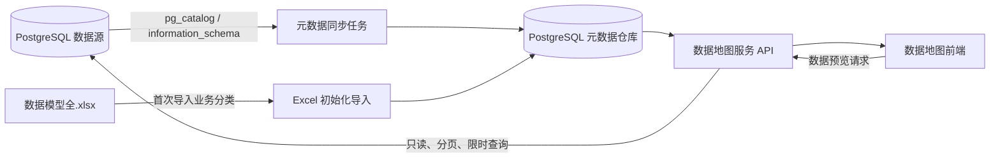

# 数据地图元数据服务改造计划

> 项目：东鹏数据地图 `plan3`  
> 文档状态：实施中（阶段四：技术元数据同步）
> 编制日期：2026-09-24  
> 最近更新：2026-09-29
> 目标版本：元数据服务化 MVP

## 1. 背景

当前数据地图使用根目录下的 `data.js` 作为前端运行时数据源，页面加载后通过 `window.DATA_MAP` 在浏览器内完成目录树、关系图、筛选和详情展示。原始目录主要来自 `数据模型全.xlsx`，项目内还存在 `src/data.js` 和 Excel 提取脚本，数据维护链路尚未完全统一。

当前方式适合静态 Demo，但存在以下问题：

- Excel、`data.js`、`src/data.js` 之间可能出现版本不一致。
- 表结构变化不能自动反映到数据地图。
- 元数据只存在于前端静态文件，无法记录同步历史和变更情况。
- PostgreSQL 连接已经能够配置，但目录数据还没有从数据库读取。
- 多个物理表可能被拼接在一个英文表名字段中，不便于分别管理字段和数据预览。
- 字段名称、字段类型、主键、注释、表大小等技术元数据尚未接入。
- 数据表详情只能展示目录信息，不能安全地实时查看数据。

## 2. 改造目标

本次改造将数据地图调整为以下模式：

1. 表及字段的元数据信息统一保存在数据地图服务的元数据仓库中。
2. 服务定时从已配置的 PostgreSQL 数据源采集技术元数据。
3. L1、L2、L3、负责人、标签等业务元数据由服务统一维护。
4. 用户查看表数据时，由服务端受控地实时查询 PostgreSQL。
5. 前端不再直接依赖 `data.js`，统一通过服务端 API 获取目录数据。
6. PostgreSQL 暂时不可用时，数据地图仍能展示最近一次成功同步的元数据。
7. 所有同步、预览和异常均有运行日志、可定位、可恢复。
8. 前端与后端在代码和职责上分离，MVP 仍可作为一个应用整体部署，降低内网部署复杂度。

## 3. 非目标范围

MVP 阶段暂不实现：

- 面向用户开放任意 SQL 编辑器。
- 全量数据下载和大规模数据导出。
- 自动解析复杂 SQL 得到完整字段级血缘。
- 用户登录、统一身份认证（SSO）、多租户和角色权限（RBAC）。
- 按用户、部门或岗位控制资产、字段和数据行的访问权限。
- 数据申请、审批、授权和按用户追踪访问行为。
- 自动生成所有业务分类、负责人和敏感等级。
- 替代现有数据仓库、数据治理或调度平台。

## 4. 总体架构



### 4.1 数据职责划分

| 数据类型 | 主要内容 | 维护方式 | 同步时是否覆盖 |
|---|---|---|---|
| 技术元数据 | Schema、物理表、字段、类型、主键、注释、表大小、预估行数 | PostgreSQL 自动采集 | 是 |
| 业务元数据 | L1、L2、L3、中文名称、负责人、业务说明、标签、敏感等级 | Excel 初始化后在服务中维护 | 否 |
| 运行元数据 | 最近同步时间、同步状态、错误、版本指纹、最后发现时间 | 服务自动记录 | 是 |
| 数据内容 | 表中的实际业务数据 | PostgreSQL 实时查询 | 不落入元数据仓库 |

### 4.2 MVP 使用边界

当前服务仅供公司内网可信用户使用，MVP 按“内网单应用、无用户体系”设计：

- 不提供登录页，不维护用户、角色、组织和授权关系。
- 所有进入内网服务的用户看到相同的元数据目录和数据预览能力。
- 应用接口暂不校验用户身份，也不执行按人、按部门或按字段的数据权限判断。
- 设置页面同样不增加应用级管理员角色，访问边界由内网、VPN、反向代理或服务器网络策略负责。
- 服务端仍不接受任意 SQL、数据库账号或表名；这属于数据库稳定性和防误操作要求，不属于用户权限系统。
- API 层预留统一中间件入口，后续需要登录或权限时可以扩展，不影响元数据模型和同步流程。

### 4.3 前后端分离原则

项目采用“代码与职责分离、部署保持简单”的方案：

- 前端只负责数据地图、目录树、关系图、筛选、详情侧边栏和设置页面等界面交互。
- 后端负责目录 API、元数据仓库读写、数据源连接、密码读取、定时同步和实时数据预览。
- 浏览器不能直接连接 `CATALOG_DB` 或 `SOURCE_DB`，也不能持有数据库密码。
- 前后端之间只通过 `/api/**` 接口交换 JSON 数据。
- 开发环境允许前端开发服务器和后端 API 分别启动，以便独立调试和热更新。
- MVP 部署时不强制拆成两台服务器或两个容器。前端构建为静态文件后，可由 Nginx 或 Node.js 后端统一提供。
- 正式访问采用同域方案：网页访问 `/`，接口访问 `/api/**`，默认不引入跨域配置和额外网关复杂度。
- 后续访问量或团队规模扩大时，可以在不修改 API 契约的情况下将前端、API 和定时任务分别部署。

目标代码目录建议调整为：

```text
plan3/
├── frontend/          # 页面、组件、样式和关系图交互
├── backend/           # API、数据库访问、同步任务和预览查询
├── db/
│   └── migrations/    # 元数据仓库结构版本
├── deploy/            # Nginx、systemd 等部署配置
├── compose.yaml
├── .env.example
└── README.md
```

现有页面可分阶段迁入 `frontend/`，现有 Node.js 服务迁入 `backend/`，不要求一次性重写界面或更换技术栈。

## 5. 元数据仓库设计

### 5.1 技术选型

考虑到项目后续需要部署到服务器，元数据仓库建议从一开始就使用 PostgreSQL，不再把 SQLite 作为默认正式方案。SQLite 不需要单独安装数据库服务，但它是单文件数据库，更适合离线 Demo；如果先使用 SQLite，服务器部署时还需要进行数据库迁移、连接层改造和数据核对。

推荐把两类 PostgreSQL 连接分开：

| 连接 | 用途 | 权限建议 |
|---|---|---|
| 元数据仓库 `CATALOG_DB` | 保存目录、字段、分类、同步记录和人工维护信息 | 数据地图服务拥有读写权限 |
| 业务数据源 `SOURCE_DB` | 被定时采集元数据，并提供受控实时数据预览 | 数据地图服务只拥有只读权限 |

最简部署时，两者可以位于同一台 PostgreSQL 服务器，但应使用不同数据库或不同 Schema、不同账号和不同权限。正式环境更推荐独立的元数据数据库，使业务数据源临时不可用时，数据地图仍能展示最近一次同步的元数据。

本地开发可以选择：

- 连接公司已有的 PostgreSQL，并创建独立数据库 `datamap_catalog`；或
- 使用 Docker Compose 启动本地 PostgreSQL 容器。

因此不需要专门下载和运行 SQLite 服务，也不需要在后续部署时迁移 SQLite 文件。

### 5.2 本地与服务器部署设计

#### 本地开发环境

```text
浏览器 → 前端开发服务器
                  ↓ /api 代理
           Node.js 后端服务
                  ├── CATALOG_DB：本地/测试 PostgreSQL
                  └── SOURCE_DB：业务 PostgreSQL（只读）
```

- 前端和后端提供独立开发启动命令，并补充一个同时启动两者的根目录命令。
- 前端开发服务器将 `/api` 代理到后端，避免在业务代码中写死服务地址。
- 元数据仓库连接通过环境变量配置。
- 业务数据源仍可通过设置页面配置。
- macOS 本地开发时，业务数据库密码可以继续保存在钥匙串。
- 数据库结构通过版本化 migration 脚本创建，不允许在代码中临时建表。

#### 单台 Linux 服务器

推荐结构：

```text
Nginx / HTTPS
      ├── /       → 前端静态文件
      └── /api/** → Node.js 后端服务（systemd 或 Docker）
                         ├── PostgreSQL 元数据仓库
                         └── 业务 PostgreSQL 只读连接
```

- Nginx 负责 HTTPS、反向代理和静态资源缓存。
- Node.js 服务由 `systemd` 或 Docker Restart Policy 保持运行。
- 元数据 PostgreSQL 使用持久化磁盘或独立数据库服务。
- 数据库密码通过服务器环境变量、Docker Secret、Kubernetes Secret 或企业密钥管理服务注入。
- 服务器部署后不再依赖 macOS 钥匙串。
- 服务账号、日志目录和配置目录使用最小文件权限。

#### Docker Compose 部署

建议提供以下组件：

```text
datamap-app       Node.js API 与构建后的前端静态文件
datamap-catalog   PostgreSQL 元数据仓库
catalog-volume    PostgreSQL 持久化数据卷
```

`datamap-app` 在代码结构上仍包含独立的 `frontend/` 和 `backend/`，但 MVP 构建后放入同一镜像或同一服务器运行。这样既保持前后端边界，也不增加内部部署组件数量。

需要在项目中补充：

- `Dockerfile`
- `compose.yaml`
- `.env.example`
- `db/migrations/`
- `/health/live` 和 `/health/ready` 健康检查接口
- 容器启动时执行数据库迁移的脚本

`compose.yaml` 中只引用环境变量，不写真实密码。生产环境的元数据数据库也可以替换成公司统一提供的 PostgreSQL，不必启动 `datamap-catalog` 容器。

#### 多实例或正式生产环境

- Web/API 服务可以启动多个实例。
- 定时同步任务必须使用 PostgreSQL Advisory Lock 或独立 Worker，保证同一数据源只有一个任务执行。
- 元数据仓库必须是所有应用实例共享的 PostgreSQL。
- 业务数据预览建议连接只读副本或数据仓库查询节点。
- 使用负载均衡、统一日志、指标监控和告警。
- 元数据仓库执行每日备份，并定期验证恢复流程。

#### 推荐环境变量

```text
NODE_ENV=production
PORT=58973
CATALOG_DATABASE_URL=postgresql://...
SOURCE_CREDENTIAL_PROVIDER=env|secret-manager|keychain
CATALOG_SYNC_ENABLED=true
CATALOG_SYNC_INTERVAL_MINUTES=60
QUERY_TIMEOUT_MS=10000
QUERY_MAX_ROWS=200
```

真实 `.env` 文件不得提交代码仓库，项目只提供不含密码的 `.env.example`。

### 5.3 核心数据表

#### `data_sources`：数据源

| 字段 | 说明 |
|---|---|
| `id` | 数据源 ID |
| `name` | 连接名称 |
| `type` | 数据源类型，当前为 `postgresql` |
| `host`、`port`、`database_name` | 非敏感连接信息 |
| `default_schema` | 默认 Schema |
| `ssl_mode` | SSL 模式 |
| `enabled` | 是否启用同步 |
| `sync_interval_minutes` | 同步间隔 |
| `last_success_at` | 最近成功同步时间 |
| `created_at`、`updated_at` | 创建和更新时间 |

本地 macOS 开发时，业务数据源密码可以保存在钥匙串中；服务器部署时改由环境变量或密钥管理服务提供。密码不得写入元数据仓库、浏览器或代码仓库。

#### `catalog_assets`：L4 逻辑数据资产

| 字段 | 说明 |
|---|---|
| `id` | 逻辑资产 ID |
| `asset_code` | 稳定业务编号 |
| `name_cn` | 中文名称 |
| `l1_domain` | 一级主题域 |
| `l2_topic` | 二级主题域 |
| `l3_object` | 三级业务对象 |
| `owner` | 模型负责人 |
| `description` | 业务说明 |
| `online_status` | 上线状态 |
| `lake_status` | 入湖状态 |
| `sensitivity_level` | 敏感等级 |
| `source_row` | 原 Excel 行号，便于追溯 |
| `created_at`、`updated_at` | 创建和更新时间 |

#### `catalog_physical_tables`：物理表

| 字段 | 说明 |
|---|---|
| `id` | 物理表 ID |
| `asset_id` | 对应 L4 逻辑资产 |
| `source_id` | 所属数据源 |
| `schema_name` | Schema 名称 |
| `table_name` | 物理表名 |
| `table_type` | 普通表、视图、物化视图等 |
| `table_comment` | PostgreSQL 表注释 |
| `estimated_rows` | 预估行数 |
| `total_bytes` | 表及索引占用空间 |
| `structure_hash` | 表结构指纹 |
| `is_active` | 当前是否仍存在 |
| `last_seen_at` | 最近一次在源库中发现的时间 |

唯一键：`source_id + schema_name + table_name`。

#### `catalog_columns`：字段元数据

| 字段 | 说明 |
|---|---|
| `id` | 字段记录 ID |
| `physical_table_id` | 所属物理表 |
| `column_name` | 字段名称 |
| `ordinal_position` | 字段顺序 |
| `data_type` | 数据类型 |
| `is_nullable` | 是否允许为空 |
| `default_value` | 默认值 |
| `is_primary_key` | 是否为主键 |
| `column_comment` | 字段注释 |
| `sensitivity_level` | 字段敏感等级 |
| `masking_rule` | 脱敏规则 |

#### `catalog_sync_runs`：同步记录

| 字段 | 说明 |
|---|---|
| `id` | 同步批次 ID |
| `source_id` | 数据源 ID |
| `trigger_type` | 定时、启动、手动 |
| `status` | 运行中、成功、部分成功、失败 |
| `started_at`、`finished_at` | 开始和结束时间 |
| `tables_found` | 发现的表数量 |
| `tables_created` | 新增数量 |
| `tables_updated` | 更新数量 |
| `tables_offline` | 标记下线数量 |
| `error_message` | 脱敏后的错误信息 |

#### `catalog_annotations`：人工维护信息

用于保存用户补充的标签、说明、负责人、敏感等级等信息。自动同步任务不得覆盖这些字段。

## 6. PostgreSQL 元数据采集

### 6.1 采集范围

通过 `pg_catalog` 和 `information_schema` 获取：

- Schema、表和视图。
- 字段名称、顺序、类型、长度、精度和是否为空。
- 主键和索引。
- 表注释和字段注释。
- 表及索引占用空间。
- PostgreSQL 统计信息中的预估行数。

默认排除：

- `pg_catalog`
- `information_schema`
- `pg_toast`
- 临时 Schema
- 配置中明确排除的 Schema 和表

### 6.2 同步策略

1. 服务启动后读取最近一次同步状态。
2. 已保存且可用的数据源在启动后执行一次同步。
3. 按配置的间隔执行定时同步，MVP 默认 60 分钟。
4. 同一数据源只允许一个同步任务运行；上一次未结束时跳过本次任务。
5. 每次同步先创建 `catalog_sync_runs` 记录。
6. 按唯一键对物理表和字段执行 Upsert。
7. 通过 `structure_hash` 判断表结构是否变化。
8. 本轮未发现但历史存在的表只标记 `is_active = false`，不立即删除。
9. 同步失败时保留上一次成功结果，不清空目录。
10. 同步完成后更新数据源状态和同步统计。

### 6.3 业务信息合并原则

- PostgreSQL 采集只更新技术元数据。
- Excel 导入用于初始化 L1、L2、L3、中文名称、负责人等业务字段。
- 人工修改后的字段具有最高优先级。
- 物理表通过 `schema_name + table_name` 与 L4 逻辑资产匹配。
- 无法匹配的物理表进入“待分类资产”，不直接丢弃。
- 一个 L4 逻辑资产可以关联多张物理表。
- 同一张物理表原则上只对应一个主要 L4 资产；需要复用时使用显式关联表。

## 7. 实时数据预览

### 7.1 功能边界

实时查询只用于受控数据预览，不提供任意 SQL 执行能力。

建议默认规则：

- 每次返回 50 行，最大 200 行。
- 必须分页，不允许一次读取整张表。
- 查询超时默认 10 秒。
- 只允许读取已同步且处于启用状态的物理表。
- 默认最多展示 30 个字段。
- 不默认执行精确 `COUNT(*)`，总行数优先使用 PostgreSQL 预估值。
- 大字段、二进制字段和敏感字段默认隐藏或脱敏。
- 数据导出不纳入 MVP。

### 7.2 数据库基础防护（不含用户权限系统）

- PostgreSQL 使用专用只读账号。
- 账号只授予需要采集和预览的 Schema 的 `USAGE` 和表的 `SELECT` 权限。
- 前端只提交资产 ID、分页和受支持的过滤条件。
- 表名和字段名必须来自元数据仓库白名单，不能直接信任请求参数。
- 所有标识符使用数据库驱动提供的安全引用方式。
- 禁止将前端输入直接拼接为 SQL。
- 设置 `statement_timeout`、返回行数限制和并发限制。
- MVP 不实现基于用户身份的行级、列级权限判断。
- 如已明确配置敏感字段，可对手机号、证件号、薪资等字段统一脱敏；不按用户身份动态变化。
- 记录资产、请求时间、耗时和结果状态等运行日志，不记录“预览人”和完整数据内容。
- 正式环境优先连接只读副本或数据仓库查询节点，避免影响生产业务库。

### 7.3 查询异常处理

- 表在同步后被删除：返回“表结构已变化，请重新同步”。
- 字段发生变化：刷新该表元数据后提示用户重试。
- 查询超时：主动取消数据库查询并返回明确提示。
- 数据源不可用：仍展示元数据，同时禁用数据预览。
- 数据库只读账号缺少 `SELECT` 或 `USAGE`：显示所需的数据库授权范围，不回传连接密码或完整错误栈。

## 8. 服务端 API 设计

### 8.1 目录接口

| 方法 | 路径 | 说明 |
|---|---|---|
| `GET` | `/api/catalog/summary` | 总表数、主题域数、上线和入湖统计 |
| `GET` | `/api/catalog/domains` | 获取 L1/L2/L3 目录树 |
| `GET` | `/api/catalog/assets` | 分页查询 L4 资产，支持筛选和搜索 |
| `GET` | `/api/catalog/assets/:id` | 获取逻辑资产及关联物理表详情 |
| `GET` | `/api/catalog/tables/:id/columns` | 获取字段结构 |

### 8.2 数据预览接口

| 方法 | 路径 | 说明 |
|---|---|---|
| `GET` | `/api/catalog/tables/:id/preview` | 受控分页预览表数据 |
| `GET` | `/api/catalog/tables/:id/stats` | 获取表大小、预估行数等信息 |

预览参数建议：

```text
page=1
pageSize=50
sortColumn=updated_at
sortDirection=desc
```

筛选条件应采用结构化 JSON 或预定义运算符，不接收原始 SQL。

### 8.3 同步管理接口

| 方法 | 路径 | 说明 |
|---|---|---|
| `GET` | `/api/catalog/sync/status` | 查询当前同步状态 |
| `GET` | `/api/catalog/sync/runs` | 查询同步历史 |
| `POST` | `/api/catalog/sync/run` | 手动触发同步 |
| `PUT` | `/api/catalog/sync/settings` | 修改同步周期和采集范围 |

### 8.4 业务元数据维护接口

| 方法 | 路径 | 说明 |
|---|---|---|
| `PATCH` | `/api/catalog/assets/:id` | 修改业务分类、负责人、说明等 |
| `POST` | `/api/catalog/import/excel` | 首次或补充导入 Excel 目录 |

## 9. 前端改造

### 9.1 数据加载

- 移除页面对 `window.DATA_MAP` 的运行时依赖。
- 页面启动时请求目录摘要和主题域接口。
- 搜索、状态筛选、L2/L3 筛选通过服务端参数执行。
- 关系图按当前筛选结果加载节点，避免一次返回过多数据。
- 为目录、关系图、详情和预览分别增加加载、空状态和失败状态。

### 9.2 详情侧边栏

现有详情侧边栏保留，并补充：

- 物理表切换。
- 字段结构列表。
- 数据量和存储量。
- 最近同步时间和同步状态。
- 数据预览标签页。
- 数据源不可用提示。
- 敏感字段标识和脱敏说明。

### 9.3 设置页面

在现有 PostgreSQL 连接配置基础上增加：

- 是否启用元数据同步。
- 同步周期。
- 包含和排除的 Schema。
- 最近同步结果。
- “立即同步”按钮。
- 同步历史入口。
- 连接正常但同步失败时的独立状态提示。

MVP 不为设置页面增加登录或管理员角色。部署时应仅在公司内网开放服务端口，接口响应不得返回已保存的数据库密码。

## 10. 当前数据迁移

### 10.1 Excel 初始化导入

1. 读取 `数据模型全.xlsx` 的“模型目录”工作表。
2. 标准化 L1、L2、L3、L4 前缀和空白字符。
3. 创建 L4 逻辑资产记录。
4. 将一个英文表名字段中的多个物理表拆分为多条关联记录。
5. 规范化 Schema 和物理表名大小写。
6. 保存原 Excel 行号，便于核对。
7. 输出导入报告：成功、重复、缺失英文表名、无法匹配。

### 10.2 静态文件下线

在 API 验证通过前保留 `data.js` 作为回退数据源。完成验收后：

- `data.js` 不再作为页面正式数据源。
- `src/data.js` 停止维护并删除或归档。
- Excel 提取脚本改造成导入元数据仓库的命令。
- 增加 `npm run import:catalog` 和 `npm run sync:catalog` 命令。

## 11. 实施阶段

### 实施进度记录

| 日期 | 改造项 | 状态 | 验证结果 |
|---|---|---|---|
| 2026-09-24 | 运行时代码迁入 `frontend/`、`backend/`，建立 `db/migrations/`、`deploy/` | 已完成 | 首页、设置页、静态资源和 PostgreSQL 状态接口保持可用 |
| 2026-09-24 | 增加 migration 执行器和第一版元数据仓库结构 | 已完成 | 已在隔离的临时 PostgreSQL 创建 7 张表（含版本表）并验证重复执行安全；未连接或改动业务数据源 |
| 2026-09-24 | 创建独立本地 `CATALOG_DB` 并应用首版 migration | 已完成 | PostgreSQL 15 数据库 `datamap_catalog` 由专用角色 `datamap_catalog_app` 持有；创建 7 张表，重复执行可安全跳过 |
| 2026-09-28 | 改造 Excel 初始化导入并导入“模型目录” | 已完成 | 导入 272 条 L4、165 张唯一物理表和 1 个数据源；二次执行新增均为 0；报告记录 108 条缺英文表名、5 条多物理表、7 组物理表关联冲突和 4 个空 L1 |
| 2026-09-28 | 新增元数据管理页面与业务元数据维护接口 | 已完成 | 首页新增“元数据管理”入口；页面可分页查看 272 条资产并搜索、筛选、排序；支持编辑中文名、L1/L2/L3、负责人、状态、敏感等级和业务说明；物理表保持只读；浏览器检查无报错 |
| 2026-09-28 | 详情侧边栏增加 PostgreSQL 表数据查询 | 已完成 | 通过元数据仓库白名单解析当前物理表，使用已保存业务库连接执行只读分页查询；默认 20 行、最大 100 行、10 秒超时；组织架构表实测第 1/2 页均返回 20 行，浏览器无报错 |
| 2026-09-28 | 接入并同步 PostgreSQL 字段结构 | 部分完成 | 新增字段同步命令、字段软下线 migration 和字段查询接口；完成最新一轮 Schema 修正后，当前数据源匹配 100/165 张物理表并同步 5,699 个字段，65 张登记表未找到并标记离线；“组织架构表”侧边栏已展示 46 个字段及类型、可空性和备注 |
| 2026-09-28 | 元数据管理页面展示字段结构 | 已完成 | 资产列表新增“字段结构”操作；支持多物理表切换、在线状态和最近同步时间展示，并显示字段顺序、名称、类型、主键、可空性、默认值、备注和敏感等级；“组织架构表”实测展示 46 个字段，浏览器无报错 |
| 2026-09-28 | v2 业务主题分布改为五级钻取卡片 | 已完成 | 原画布散点图改为矩形分布卡片，支持 L1 → L2 → L3 → L4 → 实体表逐级钻取、面包屑返回和状态筛选；每次钻取同步更新下方目录；“考勤记录”实测拆分并展示 4 张实体表，点击第 3 张可直接打开对应物理表详情，浏览器无报错 |
| 2026-09-28 | 应用资产清单黄色标注的 Schema 前缀更新 | 已完成 | 从 `数据地图资产清单.xlsx` 精确更新 32 个黄色“英文表名”单元格（对应 33 个物理表引用），忽略 2 个非英文表名黄色单元格；元数据仓库安全地原位更新 35 条 Schema、补充 1 张物理表，默认 `PUBLIC` 表由 38 张降至 4 张；重新同步后匹配率由 83/165 提升至 97/166，字段数由 5,215 增至 5,502 |
| 2026-09-28 | 修正 4 组表名与 Schema 映射 | 已完成 | 将 `WR_LTC_CNTC_ITEM_INFO_T` 修正为 `DWRLTC.DWR_LTC_CNTC_ITEM_INFO_T`，并为 3 张客户维表补齐 `DWRDIM`；同名客户基础表在两个业务资产中出现，共更新 5 个 Excel/前端单元格；清理 2 条无字段的错误 `PUBLIC` 残留后，4 张目标表均在线，字段同步达到 100/165 张、5,699 个字段，元数据仓库已无 `PUBLIC` 物理表 |
| 2026-09-29 | 侧边栏资产信息改为物理表指标并提供维护入口 | 已完成 | 资产信息改为质量分、SLA 达成率、存储量、数据行数、下游引用、访问热度六宫格；存储量使用 `pg_size_pretty(pg_total_relation_size(...))`，数据行数使用只读 `COUNT(*)` 按需计算并缓存；其余四项默认空值，可在元数据管理页按物理表编辑。`DWRDIM.DWR_DIM_SAP_DEPT_INFO_F` 实测返回 4616 KB、63,184 行，编辑保存与恢复空值通过，浏览器控制台无报错 |
| 2026-09-29 | 详情侧边栏直达对应元数据编辑 | 已完成 | 底部“复制表名”改为“编辑元数据”；跳转时携带当前资产编码，元数据管理页精确筛选并自动打开对应资产编辑弹窗。使用无物理表名的“薪酬计划”实测成功打开 `excel:model-directory:0041`，中文名和 L1/L2/L3 均准确带入，浏览器控制台和页面错误为空 |
| 2026-09-29 | 按 Excel 同步资产类型与数据分层标签 | 已完成 | 新增 `004_physical_table_labels.sql`，将 Excel“资产类型/数据分层”按物理表导入元数据仓库；165 张物理表全部同步资产类型，163 张同步数据分层，2 张 Excel 空值保留待完善。详情侧边栏停止按表名前缀推断，改为展示真实“事实表/维度表”和“模型层/应用层”；元数据管理页可按物理表编辑两个标签。同步修复 Excel 静态数据生成器，使其保留前端既有字段结构并清理 `L1-L4` 展示前缀。`员工绩效结果` 实测详情展示“事实表 / 模型层”，元数据编辑弹窗正确回显两个可配置标签，保存同值后更新时间刷新；浏览器控制台与页面错误为空，前后端语法与差异检查通过 |

### 阶段一：元数据仓库与初始化导入

- [x] 建立 `frontend/`、`backend/`、`db/migrations/` 和 `deploy/` 目标目录，先迁移文件，不改变现有页面行为。
- [x] 创建 PostgreSQL 元数据数据库或独立 Schema。（本地开发库 `datamap_catalog`）
- [x] 增加数据库 migration 和版本管理机制。
- [x] 创建数据源、逻辑资产、物理表、字段和同步记录表。
- [x] 改造 Excel 导入脚本。
- [x] 将 272 条现有 L4 目录导入元数据仓库。
- [x] 将多物理表字符串拆分为独立记录。
- [x] 生成导入校验报告。

交付标准：元数据仓库中的 L1/L2/L3/L4 数量与现有页面一致，所有记录可追溯到 Excel 行号。

当前核对结果：L4 为 272 条，唯一物理表为 165 张，含资产的 L1/L2/L3 分别为 10/41/118，与现有页面一致；工作簿另外包含 4 个暂无 L4 的空 L1，已保留在导入报告中，待后续增加独立分类节点存储后再完成阶段一交付验收。

### 阶段二：目录查询 API

- [ ] 后端代码只暴露 `/api/**`、健康检查和前端静态资源，不把数据库连接能力暴露给浏览器。
- [ ] 实现目录摘要、主题域、资产列表和资产详情接口。
- [x] 实现搜索、筛选、分页和排序。
- [ ] 增加统一错误响应和日志脱敏。
- [x] 增加接口参数校验。（已覆盖当前目录摘要、资产列表和资产更新接口）

交付标准：API 返回的目录统计与当前 `data.js` 一致，筛选结果正确。

当前进度：已实现目录摘要、资产列表、字段查询、业务元数据更新和物理表资产指标更新接口，以及独立的元数据管理页面；管理页面可从资产列表查看已同步字段结构、切换同一资产下的物理表，并维护质量分、SLA 达成率、下游引用和访问热度。主题域接口、单资产详情接口、全局错误/日志规范仍待完成。主数据地图尚未切换 API，继续保留 `data.js` 作为当前展示数据源。

### 阶段三：前端切换到 API

- [ ] 前端统一封装 API Client，不在页面组件中直接读取数据库配置或拼接后端地址。
- [ ] 替换 `window.DATA_MAP` 数据源。
- [ ] 改造目录树、Data Catalog 和关系图加载逻辑。
- [ ] 保持现有 L2/L3 关联模式、筛选和选中联动。
- [ ] 增加加载、失败、重试和离线元数据提示。
- [ ] 保留静态数据回退开关。

交付标准：页面主要交互与当前版本一致，刷新页面后数据来自服务端 API。

当前进度：v2 首页已完成业务主题分布交互改造，基于现有目录数据支持 L1、L2、L3、L4 和实体表五级钻取；一个 L4 的多个物理表会独立展示，并与下方 Data Catalog、状态筛选和详情抽屉联动。该区域当前仍读取 `window.DATA_MAP`，待目录 API 完整后再切换服务端数据源。

### 阶段四：PostgreSQL 定时元数据同步

- [x] 实现 `pg_catalog` / `information_schema` 元数据采集器。
- [x] 实现已登记表、字段的 Upsert 和软下线。
- [x] 实现物理表存储量与精确数据行数的按需计算和缓存。
- [x] 实现质量分、SLA、下游引用和访问热度的人工维护。
- [ ] 实现结构指纹和增量更新。
- [ ] 实现启动同步、定时同步和手动同步。
- [ ] 实现同步互斥锁、超时和失败恢复。
- [ ] 设置页展示同步状态和历史。

交付标准：在 PostgreSQL 新增字段后，下次同步可以更新侧边栏字段结构；删除表后不会误删业务资产。

当前进度：已提供 `npm run sync:catalog` 手动同步命令，保存表/字段技术元数据、主键、备注、结构指纹、在线状态和同步记录；主数据地图侧边栏和元数据管理页面均通过元数据仓库接口展示当前物理表字段。完成最新 Schema 修正并重新同步后，找到 100/165 张登记表和 5,699 个字段，另外 65 张按登记 Schema/表名未在当前数据源中找到，已保留资产并标记物理表离线；元数据仓库已无默认 `PUBLIC` 物理表。资产详情现在会按当前物理表使用 PostgreSQL 原生存储量函数和精确 `COUNT(*)` 按需刷新技术指标，并将结果缓存到元数据仓库；四项业务指标由管理页维护。结构指纹已记录，但基于指纹跳过未变化表的增量优化、启动/定时同步和设置页同步历史仍待完成。

### 阶段五：实时数据预览

- [x] 实现只读分页预览接口。
- [x] 加入白名单、标识符安全引用和查询超时。
- [ ] 加入行数、字段数和并发限制。
- [ ] 支持可选的统一字段脱敏规则，不实现按用户动态脱敏。
- [ ] 详情侧边栏增加“字段结构”和“数据预览”标签页。
- [ ] 增加不含用户身份的预览运行日志。

交付标准：只能查询服务端白名单中的资产；超大表不会全表返回；已配置的敏感字段按统一规则脱敏。

当前进度：详情侧边栏已增加“表数据查询”区域，支持每页 20 行的上一页、下一页和刷新；接口只接受资产编码与物理表序号，并在元数据仓库中解析实际表名。已完成单次最大 100 行限制，但字段数、并发限制、统一脱敏和预览运行日志仍待实现。

### 阶段六：清理与正式切换

- [ ] 对比 API 和原静态数据的数量及分类。
- [ ] 完成回归测试和性能测试。
- [ ] 默认关闭静态数据回退开关。
- [ ] 归档重复的 `src/data.js`。
- [ ] 提供 `Dockerfile`、`compose.yaml` 和 `.env.example`。
- [ ] 增加服务存活、就绪和数据库连接健康检查。
- [ ] 编写 Linux `systemd` 与 Docker 两种部署说明。
- [ ] 验证 migration、元数据备份和恢复流程。
- [ ] 更新 README、启动方式和运维说明。

交付标准：`data.js` 不再参与正式运行；服务可以在全新服务器上按文档部署；重启应用或容器后元数据和同步记录不丢失。

## 12. 验收标准

### 12.1 元数据

- 页面中的表数量与元数据仓库一致。
- L1、L2、L3、L4 层级关系正确。
- 一个逻辑资产关联多张物理表时可以逐张切换。
- 字段新增、删除和类型变化可以被同步识别。
- 自动同步不会覆盖人工维护的负责人、说明和分类。
- PostgreSQL 断开时仍能查看上一次同步的目录。

### 12.2 数据预览

- 只能预览白名单中的表和字段。
- 默认分页且不能突破最大返回行数。
- 查询超时能够被取消并返回明确提示。
- 已配置脱敏规则的字段不会以原文返回。
- 前端不能通过构造参数执行任意 SQL。
- 数据库密码不出现在浏览器、日志和接口响应中。
- 系统无需登录即可在内网访问，且不包含角色、资产授权或按用户审计逻辑。

### 12.3 稳定性

- 服务重启后自动恢复元数据仓库和定时任务。
- 同一数据源不会并发执行多个同步任务。
- 同步失败不会清空现有目录。
- 所有同步批次都有开始时间、结束时间、状态和统计信息。

### 12.4 部署与运维

- 前端和后端目录、依赖与构建命令相互独立。
- MVP 可以用一个域名和一个应用容器提供前端页面及 `/api/**`，无需拆分部署。
- 浏览器不包含 PostgreSQL 驱动、连接串或数据库密码。
- 本地和服务器使用同一套 PostgreSQL migration。
- Docker Compose 可以在全新环境启动应用和元数据仓库。
- 使用外部 PostgreSQL 时无需修改应用代码，只修改连接配置。
- 服务器上不依赖 macOS 钥匙串。
- 元数据 PostgreSQL 具备备份、恢复和容量监控方案。
- 多实例部署时同一数据源不会重复执行同步任务。
- 应用未连接元数据仓库时，就绪检查返回失败，但存活检查仍可用于判断进程状态。

## 13. 风险与应对

| 风险 | 影响 | 应对措施 |
|---|---|---|
| 实时查询影响生产库 | 页面查询拖慢业务系统 | 使用只读副本、分页、超时、并发限制 |
| PostgreSQL 只包含技术元数据 | 无法自动生成 L1/L2/L3 | 保留独立业务元数据和 Excel 初始化导入 |
| 自动同步覆盖人工信息 | 负责人和分类丢失 | 技术字段与人工字段分表或分列管理 |
| 表结构在预览时变化 | 查询报错 | 返回可恢复提示并触发单表元数据刷新 |
| 多物理表字符串不规范 | 无法准确拆分 | 导入报告、人工确认、建立明确关联表 |
| 敏感数据泄露 | 合规与业务风险 | 限制内网访问、只读账号、可选字段分级和统一脱敏、运行日志 |
| 本地服务未运行 | 同步任务不执行 | 当前使用 macOS 用户级后台服务；正式环境部署为系统服务或容器 |
| 元数据仓库与业务源共用实例 | 源库故障时目录也不可用 | 正式环境使用独立元数据 PostgreSQL |
| 多实例重复执行定时任务 | 重复采集、数据竞争 | PostgreSQL Advisory Lock 或独立 Worker |
| 服务器密钥管理方式变化 | 本地钥匙串无法直接迁移 | 抽象凭据提供器，生产使用环境变量或 Secret Manager |

## 14. 回滚方案

- 改造期间保留现有 `data.js`。
- 前端增加 `CATALOG_API_ENABLED` 配置开关。
- API 或元数据仓库异常时可临时切回静态数据。
- 元数据同步使用软下线，不直接删除历史资产。
- 每次数据库结构升级前备份元数据 PostgreSQL，并验证 migration 回滚或恢复方案。
- 正式切换稳定后再移除静态回退路径。

## 15. 建议实施顺序

推荐按以下顺序推进：

1. 先完成元数据仓库和 Excel 初始化导入。
2. 再完成目录 API，并保证与当前 272 条记录一致。
3. 前端切换 API，但保留静态回退。
4. 接入 PostgreSQL 技术元数据定时同步。
5. 最后开放受控实时数据预览。

不建议一开始同时改造前端、同步任务和实时查询，否则难以判断问题来自数据迁移、同步逻辑还是页面展示。

## 16. 完成定义

满足以下条件后，本次改造视为完成：

- 元数据统一保存在服务端持久化仓库中。
- PostgreSQL 技术元数据可以自动、手动同步。
- 同步任务具备状态、历史和失败恢复机制。
- 页面不再依赖静态 `data.js`。
- 前后端在代码和职责上分离，并通过稳定的 `/api/**` 契约通信。
- MVP 能以同域、单应用方式部署，前端静态文件和 API 无需运行在不同服务器。
- 数据预览由服务端受控查询 PostgreSQL。
- 业务元数据不会被自动同步覆盖。
- 密码不返回前端，预览查询具备白名单、分页、超时和行数限制。
- MVP 不包含登录、角色、资产授权和按用户审计；访问边界由公司内网承担。
- 项目支持 Docker Compose 和外部 PostgreSQL 两种部署方式。
- 生产环境密钥通过环境变量或密钥管理服务注入，不依赖本机钥匙串。
- 项目文档包含部署、同步、备份和回滚说明。
