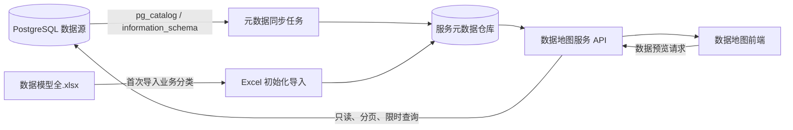

# 数据地图元数据服务改造计划

> 项目：东鹏数据地图 `plan3`  
> 文档状态：待实施  
> 编制日期：2026-09-24  
> 目标版本：元数据服务化 MVP

## 1. 背景

当前数据地图使用根目录下的 `data.js` 作为前端运行时数据源，页面加载后通过 `window.DATA_MAP` 在浏览器内完成目录树、关系图、筛选和详情展示。原始目录主要来自 `数据模型全.xlsx`，项目内还存在 `src/data.js` 和 Excel 提取脚本，数据维护链路尚未完全统一。

当前方式适合静态 Demo，但存在以下问题：

- Excel、`data.js`、`src/data.js` 之间可能出现版本不一致。
- 表结构变化不能自动反映到数据地图。
- 元数据只存在于前端静态文件，无法记录同步历史和变更情况。
- PostgreSQL 连接已经能够配置，但目录数据还没有从数据库读取。
- 多个物理表可能被拼接在一个英文表名字段中，不便于分别管理字段和数据预览。
- 字段名称、字段类型、主键、注释、表大小等技术元数据尚未接入。
- 数据表详情只能展示目录信息，不能安全地实时查看数据。

## 2. 改造目标

本次改造将数据地图调整为以下模式：

1. 表及字段的元数据信息统一保存在数据地图服务的元数据仓库中。
2. 服务定时从已配置的 PostgreSQL 数据源采集技术元数据。
3. L1、L2、L3、负责人、标签等业务元数据由服务统一维护。
4. 用户查看表数据时，由服务端受控地实时查询 PostgreSQL。
5. 前端不再直接依赖 `data.js`，统一通过服务端 API 获取目录数据。
6. PostgreSQL 暂时不可用时，数据地图仍能展示最近一次成功同步的元数据。
7. 所有同步、预览和异常均可追踪、可审计、可恢复。

## 3. 非目标范围

MVP 阶段暂不实现：

- 面向用户开放任意 SQL 编辑器。
- 全量数据下载和大规模数据导出。
- 自动解析复杂 SQL 得到完整字段级血缘。
- 多租户、复杂组织权限和统一身份认证。
- 自动生成所有业务分类、负责人和敏感等级。
- 替代现有数据仓库、数据治理或调度平台。

## 4. 总体架构



### 4.1 数据职责划分

| 数据类型 | 主要内容 | 维护方式 | 同步时是否覆盖 |
|---|---|---|---|
| 技术元数据 | Schema、物理表、字段、类型、主键、注释、表大小、预估行数 | PostgreSQL 自动采集 | 是 |
| 业务元数据 | L1、L2、L3、中文名称、负责人、业务说明、标签、敏感等级 | Excel 初始化后在服务中维护 | 否 |
| 运行元数据 | 最近同步时间、同步状态、错误、版本指纹、最后发现时间 | 服务自动记录 | 是 |
| 数据内容 | 表中的实际业务数据 | PostgreSQL 实时查询 | 不落入元数据仓库 |

## 5. 元数据仓库设计

### 5.1 技术选型

当前 `plan3` 为单机演示服务，MVP 建议采用 SQLite 作为服务内部元数据仓库：

- 与服务一起运行，不依赖额外数据库。
- PostgreSQL 中断时仍可读取最近一次元数据快照。
- 便于本地部署、备份和演示。
- 后续可迁移到独立 PostgreSQL 数据库或独立 Schema。

建议数据库文件位置：

```text
plan3/.data/catalog.sqlite
```

该目录必须保留在 `.gitignore` 中，不提交运行数据和数据库凭据。

### 5.2 核心数据表

#### `data_sources`：数据源

| 字段 | 说明 |
|---|---|
| `id` | 数据源 ID |
| `name` | 连接名称 |
| `type` | 数据源类型，当前为 `postgresql` |
| `host`、`port`、`database_name` | 非敏感连接信息 |
| `default_schema` | 默认 Schema |
| `ssl_mode` | SSL 模式 |
| `enabled` | 是否启用同步 |
| `sync_interval_minutes` | 同步间隔 |
| `last_success_at` | 最近成功同步时间 |
| `created_at`、`updated_at` | 创建和更新时间 |

数据库密码继续保存在 macOS 钥匙串中，不写入 SQLite、浏览器或代码仓库。

#### `catalog_assets`：L4 逻辑数据资产

| 字段 | 说明 |
|---|---|
| `id` | 逻辑资产 ID |
| `asset_code` | 稳定业务编号 |
| `name_cn` | 中文名称 |
| `l1_domain` | 一级主题域 |
| `l2_topic` | 二级主题域 |
| `l3_object` | 三级业务对象 |
| `owner` | 模型负责人 |
| `description` | 业务说明 |
| `online_status` | 上线状态 |
| `lake_status` | 入湖状态 |
| `sensitivity_level` | 敏感等级 |
| `source_row` | 原 Excel 行号，便于追溯 |
| `created_at`、`updated_at` | 创建和更新时间 |

#### `catalog_physical_tables`：物理表

| 字段 | 说明 |
|---|---|
| `id` | 物理表 ID |
| `asset_id` | 对应 L4 逻辑资产 |
| `source_id` | 所属数据源 |
| `schema_name` | Schema 名称 |
| `table_name` | 物理表名 |
| `table_type` | 普通表、视图、物化视图等 |
| `table_comment` | PostgreSQL 表注释 |
| `estimated_rows` | 预估行数 |
| `total_bytes` | 表及索引占用空间 |
| `structure_hash` | 表结构指纹 |
| `is_active` | 当前是否仍存在 |
| `last_seen_at` | 最近一次在源库中发现的时间 |

唯一键：`source_id + schema_name + table_name`。

#### `catalog_columns`：字段元数据

| 字段 | 说明 |
|---|---|
| `id` | 字段记录 ID |
| `physical_table_id` | 所属物理表 |
| `column_name` | 字段名称 |
| `ordinal_position` | 字段顺序 |
| `data_type` | 数据类型 |
| `is_nullable` | 是否允许为空 |
| `default_value` | 默认值 |
| `is_primary_key` | 是否为主键 |
| `column_comment` | 字段注释 |
| `sensitivity_level` | 字段敏感等级 |
| `masking_rule` | 脱敏规则 |

#### `catalog_sync_runs`：同步记录

| 字段 | 说明 |
|---|---|
| `id` | 同步批次 ID |
| `source_id` | 数据源 ID |
| `trigger_type` | 定时、启动、手动 |
| `status` | 运行中、成功、部分成功、失败 |
| `started_at`、`finished_at` | 开始和结束时间 |
| `tables_found` | 发现的表数量 |
| `tables_created` | 新增数量 |
| `tables_updated` | 更新数量 |
| `tables_offline` | 标记下线数量 |
| `error_message` | 脱敏后的错误信息 |

#### `catalog_annotations`：人工维护信息

用于保存用户补充的标签、说明、负责人、敏感等级等信息。自动同步任务不得覆盖这些字段。

## 6. PostgreSQL 元数据采集

### 6.1 采集范围

通过 `pg_catalog` 和 `information_schema` 获取：

- Schema、表和视图。
- 字段名称、顺序、类型、长度、精度和是否为空。
- 主键和索引。
- 表注释和字段注释。
- 表及索引占用空间。
- PostgreSQL 统计信息中的预估行数。

默认排除：

- `pg_catalog`
- `information_schema`
- `pg_toast`
- 临时 Schema
- 配置中明确排除的 Schema 和表

### 6.2 同步策略

1. 服务启动后读取最近一次同步状态。
2. 已保存且可用的数据源在启动后执行一次同步。
3. 按配置的间隔执行定时同步，MVP 默认 60 分钟。
4. 同一数据源只允许一个同步任务运行；上一次未结束时跳过本次任务。
5. 每次同步先创建 `catalog_sync_runs` 记录。
6. 按唯一键对物理表和字段执行 Upsert。
7. 通过 `structure_hash` 判断表结构是否变化。
8. 本轮未发现但历史存在的表只标记 `is_active = false`，不立即删除。
9. 同步失败时保留上一次成功结果，不清空目录。
10. 同步完成后更新数据源状态和同步统计。

### 6.3 业务信息合并原则

- PostgreSQL 采集只更新技术元数据。
- Excel 导入用于初始化 L1、L2、L3、中文名称、负责人等业务字段。
- 人工修改后的字段具有最高优先级。
- 物理表通过 `schema_name + table_name` 与 L4 逻辑资产匹配。
- 无法匹配的物理表进入“待分类资产”，不直接丢弃。
- 一个 L4 逻辑资产可以关联多张物理表。
- 同一张物理表原则上只对应一个主要 L4 资产；需要复用时使用显式关联表。

## 7. 实时数据预览

### 7.1 功能边界

实时查询只用于受控数据预览，不提供任意 SQL 执行能力。

建议默认规则：

- 每次返回 50 行，最大 200 行。
- 必须分页，不允许一次读取整张表。
- 查询超时默认 10 秒。
- 只允许读取已同步且处于启用状态的物理表。
- 默认最多展示 30 个字段。
- 不默认执行精确 `COUNT(*)`，总行数优先使用 PostgreSQL 预估值。
- 大字段、二进制字段和敏感字段默认隐藏或脱敏。
- 数据导出不纳入 MVP。

### 7.2 安全要求

- PostgreSQL 使用专用只读账号。
- 账号只授予允许展示的 Schema 的 `USAGE` 和表的 `SELECT` 权限。
- 前端只提交资产 ID、分页和受支持的过滤条件。
- 表名和字段名必须来自元数据仓库白名单，不能直接信任请求参数。
- 所有标识符使用数据库驱动提供的安全引用方式。
- 禁止将前端输入直接拼接为 SQL。
- 设置 `statement_timeout`、返回行数限制和并发限制。
- 手机号、证件号、薪资等敏感字段按规则脱敏。
- 记录预览人、资产、时间、耗时、结果状态，不记录完整数据内容。
- 正式环境优先连接只读副本或数据仓库查询节点，避免影响生产业务库。

### 7.3 查询异常处理

- 表在同步后被删除：返回“表结构已变化，请重新同步”。
- 字段发生变化：刷新该表元数据后提示用户重试。
- 查询超时：主动取消数据库查询并返回明确提示。
- 数据源不可用：仍展示元数据，同时禁用数据预览。
- 权限不足：显示缺失的最小权限，不回传连接密码或完整数据库错误栈。

## 8. 服务端 API 设计

### 8.1 目录接口

| 方法 | 路径 | 说明 |
|---|---|---|
| `GET` | `/api/catalog/summary` | 总表数、主题域数、上线和入湖统计 |
| `GET` | `/api/catalog/domains` | 获取 L1/L2/L3 目录树 |
| `GET` | `/api/catalog/assets` | 分页查询 L4 资产，支持筛选和搜索 |
| `GET` | `/api/catalog/assets/:id` | 获取逻辑资产及关联物理表详情 |
| `GET` | `/api/catalog/tables/:id/columns` | 获取字段结构 |

### 8.2 数据预览接口

| 方法 | 路径 | 说明 |
|---|---|---|
| `GET` | `/api/catalog/tables/:id/preview` | 受控分页预览表数据 |
| `GET` | `/api/catalog/tables/:id/stats` | 获取表大小、预估行数等信息 |

预览参数建议：

```text
page=1
pageSize=50
sortColumn=updated_at
sortDirection=desc
```

筛选条件应采用结构化 JSON 或预定义运算符，不接收原始 SQL。

### 8.3 同步管理接口

| 方法 | 路径 | 说明 |
|---|---|---|
| `GET` | `/api/catalog/sync/status` | 查询当前同步状态 |
| `GET` | `/api/catalog/sync/runs` | 查询同步历史 |
| `POST` | `/api/catalog/sync/run` | 手动触发同步 |
| `PUT` | `/api/catalog/sync/settings` | 修改同步周期和采集范围 |

### 8.4 业务元数据维护接口

| 方法 | 路径 | 说明 |
|---|---|---|
| `PATCH` | `/api/catalog/assets/:id` | 修改业务分类、负责人、说明等 |
| `POST` | `/api/catalog/import/excel` | 首次或补充导入 Excel 目录 |

## 9. 前端改造

### 9.1 数据加载

- 移除页面对 `window.DATA_MAP` 的运行时依赖。
- 页面启动时请求目录摘要和主题域接口。
- 搜索、状态筛选、L2/L3 筛选通过服务端参数执行。
- 关系图按当前筛选结果加载节点，避免一次返回过多数据。
- 为目录、关系图、详情和预览分别增加加载、空状态和失败状态。

### 9.2 详情侧边栏

现有详情侧边栏保留，并补充：

- 物理表切换。
- 字段结构列表。
- 数据量和存储量。
- 最近同步时间和同步状态。
- 数据预览标签页。
- 数据源不可用提示。
- 敏感字段标识和脱敏说明。

### 9.3 设置页面

在现有 PostgreSQL 连接配置基础上增加：

- 是否启用元数据同步。
- 同步周期。
- 包含和排除的 Schema。
- 最近同步结果。
- “立即同步”按钮。
- 同步历史入口。
- 连接正常但同步失败时的独立状态提示。

## 10. 当前数据迁移

### 10.1 Excel 初始化导入

1. 读取 `数据模型全.xlsx` 的“模型目录”工作表。
2. 标准化 L1、L2、L3、L4 前缀和空白字符。
3. 创建 L4 逻辑资产记录。
4. 将一个英文表名字段中的多个物理表拆分为多条关联记录。
5. 规范化 Schema 和物理表名大小写。
6. 保存原 Excel 行号，便于核对。
7. 输出导入报告：成功、重复、缺失英文表名、无法匹配。

### 10.2 静态文件下线

在 API 验证通过前保留 `data.js` 作为回退数据源。完成验收后：

- `data.js` 不再作为页面正式数据源。
- `src/data.js` 停止维护并删除或归档。
- Excel 提取脚本改造成导入元数据仓库的命令。
- 增加 `npm run import:catalog` 和 `npm run sync:catalog` 命令。

## 11. 实施阶段

### 阶段一：元数据仓库与初始化导入

- [ ] 增加 SQLite 初始化和版本迁移机制。
- [ ] 创建数据源、逻辑资产、物理表、字段和同步记录表。
- [ ] 改造 Excel 导入脚本。
- [ ] 将 272 条现有 L4 目录导入元数据仓库。
- [ ] 将多物理表字符串拆分为独立记录。
- [ ] 生成导入校验报告。

交付标准：元数据仓库中的 L1/L2/L3/L4 数量与现有页面一致，所有记录可追溯到 Excel 行号。

### 阶段二：目录查询 API

- [ ] 实现目录摘要、主题域、资产列表和资产详情接口。
- [ ] 实现搜索、筛选、分页和排序。
- [ ] 增加统一错误响应和日志脱敏。
- [ ] 增加接口参数校验。

交付标准：API 返回的目录统计与当前 `data.js` 一致，筛选结果正确。

### 阶段三：前端切换到 API

- [ ] 替换 `window.DATA_MAP` 数据源。
- [ ] 改造目录树、Data Catalog 和关系图加载逻辑。
- [ ] 保持现有 L2/L3 关联模式、筛选和选中联动。
- [ ] 增加加载、失败、重试和离线元数据提示。
- [ ] 保留静态数据回退开关。

交付标准：页面主要交互与当前版本一致，刷新页面后数据来自服务端 API。

### 阶段四：PostgreSQL 定时元数据同步

- [ ] 实现 `pg_catalog` 元数据采集器。
- [ ] 实现表、字段的 Upsert 和软下线。
- [ ] 实现结构指纹和增量更新。
- [ ] 实现启动同步、定时同步和手动同步。
- [ ] 实现同步互斥锁、超时和失败恢复。
- [ ] 设置页展示同步状态和历史。

交付标准：在 PostgreSQL 新增字段后，下次同步可以更新侧边栏字段结构；删除表后不会误删业务资产。

### 阶段五：实时数据预览

- [ ] 实现只读分页预览接口。
- [ ] 加入白名单、标识符安全引用和查询超时。
- [ ] 加入行数、字段数和并发限制。
- [ ] 实现字段脱敏。
- [ ] 详情侧边栏增加“字段结构”和“数据预览”标签页。
- [ ] 增加访问审计日志。

交付标准：用户只能查看已授权资产；超大表不会全表返回；敏感字段按规则脱敏。

### 阶段六：清理与正式切换

- [ ] 对比 API 和原静态数据的数量及分类。
- [ ] 完成回归测试和性能测试。
- [ ] 默认关闭静态数据回退开关。
- [ ] 归档重复的 `src/data.js`。
- [ ] 更新 README、启动方式和运维说明。

交付标准：`data.js` 不再参与正式运行，服务重启后元数据和同步记录不丢失。

## 12. 验收标准

### 12.1 元数据

- 页面中的表数量与元数据仓库一致。
- L1、L2、L3、L4 层级关系正确。
- 一个逻辑资产关联多张物理表时可以逐张切换。
- 字段新增、删除和类型变化可以被同步识别。
- 自动同步不会覆盖人工维护的负责人、说明和分类。
- PostgreSQL 断开时仍能查看上一次同步的目录。

### 12.2 数据预览

- 只能预览白名单中的表和字段。
- 默认分页且不能突破最大返回行数。
- 查询超时能够被取消并返回明确提示。
- 敏感字段不会以原文返回。
- 前端不能通过构造参数执行任意 SQL。
- 数据库密码不出现在浏览器、日志和接口响应中。

### 12.3 稳定性

- 服务重启后自动恢复元数据仓库和定时任务。
- 同一数据源不会并发执行多个同步任务。
- 同步失败不会清空现有目录。
- 所有同步批次都有开始时间、结束时间、状态和统计信息。

## 13. 风险与应对

| 风险 | 影响 | 应对措施 |
|---|---|---|
| 实时查询影响生产库 | 页面查询拖慢业务系统 | 使用只读副本、分页、超时、并发限制 |
| PostgreSQL 只包含技术元数据 | 无法自动生成 L1/L2/L3 | 保留独立业务元数据和 Excel 初始化导入 |
| 自动同步覆盖人工信息 | 负责人和分类丢失 | 技术字段与人工字段分表或分列管理 |
| 表结构在预览时变化 | 查询报错 | 返回可恢复提示并触发单表元数据刷新 |
| 多物理表字符串不规范 | 无法准确拆分 | 导入报告、人工确认、建立明确关联表 |
| 敏感数据泄露 | 合规与业务风险 | 只读账号、字段分级、脱敏、审计 |
| 本地服务未运行 | 同步任务不执行 | 当前使用 macOS 用户级后台服务；正式环境部署为系统服务或容器 |
| SQLite 不适合多实例并发 | 后续扩展受限 | MVP 单实例使用，正式环境迁移独立 PostgreSQL |

## 14. 回滚方案

- 改造期间保留现有 `data.js`。
- 前端增加 `CATALOG_API_ENABLED` 配置开关。
- API 或元数据仓库异常时可临时切回静态数据。
- 元数据同步使用软下线，不直接删除历史资产。
- 每次数据库结构升级前备份 `catalog.sqlite`。
- 正式切换稳定后再移除静态回退路径。

## 15. 建议实施顺序

推荐按以下顺序推进：

1. 先完成元数据仓库和 Excel 初始化导入。
2. 再完成目录 API，并保证与当前 272 条记录一致。
3. 前端切换 API，但保留静态回退。
4. 接入 PostgreSQL 技术元数据定时同步。
5. 最后开放受控实时数据预览。

不建议一开始同时改造前端、同步任务和实时查询，否则难以判断问题来自数据迁移、同步逻辑还是页面展示。

## 16. 完成定义

满足以下条件后，本次改造视为完成：

- 元数据统一保存在服务端持久化仓库中。
- PostgreSQL 技术元数据可以自动、手动同步。
- 同步任务具备状态、历史和失败恢复机制。
- 页面不再依赖静态 `data.js`。
- 数据预览由服务端受控查询 PostgreSQL。
- 业务元数据不会被自动同步覆盖。
- 密码、敏感字段和查询权限符合安全要求。
- 项目文档包含部署、同步、备份和回滚说明。
