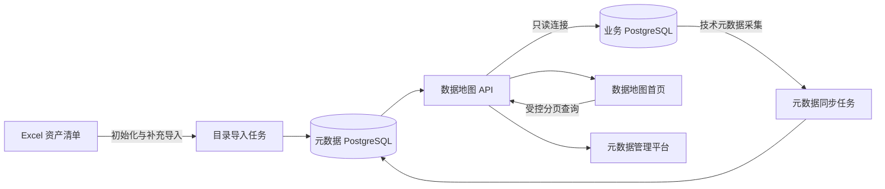

# 数据地图平台阶段性建设总结

> 项目：东鹏数据地图 `plan3`  
> 当前分支：`v2`  
> 总结日期：2026-10-06  
> 建设阶段：元数据服务化 MVP 进行中  
> 相关详细计划：`元数据服务改造计划.md`

## 1. 阶段结论

当前平台已经从“完全依赖 Excel 和前端静态文件的数据地图 Demo”，推进到“具备独立元数据仓库、元数据管理页面、PostgreSQL 技术元数据采集和受控数据查询能力”的服务化原型。

目前已经形成以下核心能力：

- 使用独立 PostgreSQL 元数据仓库保存数据表、实体表、字段、目录层级、业务属性和同步记录。
- 建立 L1 一级主题域 → L2 二级主题域 → L3 业务对象 → L4 数据表 → 实体表的完整目录关系。
- 支持数据地图逐层钻取，并在钻取时联动下方数据表列表。
- 支持在元数据管理页面编辑目录、数据表归属、业务属性、实体表关系和部分治理指标。
- 支持从业务 PostgreSQL 同步字段结构、表状态、主键、备注和技术指标。
- 支持在详情侧边栏受控查询实体表数据，不允许浏览器提交任意 SQL。

平台当前可以支撑演示、目录维护和小范围内网试用，但尚未完成正式生产切换。最主要的原因是：主数据地图和左侧目录树仍以 `frontend/data.js` 为主要目录数据源，而元数据管理页面已经使用服务端元数据 API，系统暂时存在两套数据来源。

## 2. 总体建设计划

### 2.1 建设目标

总体目标是把当前数据地图建设为一个以元数据仓库为中心的平台，使业务分类、技术元数据、运行状态和数据预览通过统一服务管理。

目标模式如下：



建设完成后应满足以下原则：

1. Excel 只用于初始化和批量补充，不再直接作为前台运行时数据源。
2. 业务元数据与技术元数据统一持久化在服务端元数据仓库中。
3. PostgreSQL 表和字段变化可以通过同步任务被平台感知。
4. 前端统一通过 `/api/**` 读取目录、详情、字段和状态。
5. 数据预览只能查询服务端白名单中的实体表，并具备分页、超时、限流和脱敏控制。
6. PostgreSQL 数据源不可用时，已同步的目录和字段仍可查看。
7. 本地开发与服务器部署使用同一套 migration 和配置模型。

### 2.2 分阶段路线

| 阶段 | 目标 | 当前状态 |
|---|---|---|
| 阶段一：元数据仓库与初始化导入 | 建库、建表、导入 Excel、拆分实体表关系 | 已完成 |
| 阶段二：目录与管理 API | 提供目录、数据表、字段、层级和编辑接口 | 主体已完成 |
| 阶段三：前端全面切换 API | 首页、目录树和 Data Catalog 不再读取静态数据 | 未完成，当前最高优先级 |
| 阶段四：技术元数据同步闭环 | 支持手动、启动和定时同步，记录历史和异常 | 已支持手动同步，自动化未完成 |
| 阶段五：受控数据预览 | 提供安全、分页、限时的数据查询 | 基础能力已完成，治理能力待补充 |
| 阶段六：生产部署与运维 | 容器化、健康检查、监控、备份和恢复 | 未完成 |

## 3. 当前平台已经实现的能力

### 3.1 元数据仓库

已在本机 PostgreSQL 中建立独立数据库 `datamap_catalog`，由专用角色 `datamap_catalog_app` 管理。数据库结构通过 migration 维护，目前已执行 `001` 至 `006` 共 6 个版本。

截至 2026-10-06，元数据仓库当前状态为：

| 指标 | 当前数量 | 说明 |
|---|---:|---|
| 数据表 | 272 张 | 对应 L4 数据表 |
| 实体表关联 | 165 条 | 已登记到元数据仓库的 PostgreSQL 实体表 |
| 已关联实体表的数据表 | 157 张 | 其余 115 张数据表暂未关联实体表 |
| 当前在线实体表 | 100 张 | 最近一次同步时在业务数据源中找到 |
| 当前离线或未找到实体表 | 65 张 | Schema、表名或源库实际状态仍需确认 |
| 有效字段 | 5,699 个 | 由 PostgreSQL 技术元数据同步得到 |
| L1 节点 | 10 个 | 当前存在数据表的一级主题域 |
| L2 节点 | 42 个 | 按父节点分别统计 |
| L3 节点 | 119 个 | 按父节点分别统计 |
| L4 节点 | 272 个 | 每张数据表对应一个 L4 节点 |

元数据仓库当前保存：

- 数据源配置和同步周期。
- 数据表中文名称、业务目录、负责人、业务说明、上线和入湖状态。
- 实体表的 Schema、英文表名、类型、在线状态和最近发现时间。
- 字段名称、字段顺序、类型、可空性、主键、默认值和备注。
- 资产类型、数据分层、质量分、SLA、下游引用和访问热度。
- 存储量、精确数据行数及其最近计算结果。
- 同步批次、同步状态、数量统计和脱敏错误信息。

### 3.2 动态目录与层级管理

平台已经建立动态目录模型：

```text
L1 一级主题域
└── L2 二级主题域
    └── L3 业务对象
        └── L4 数据表
            ├── 实体表 A
            └── 实体表 B
```

当前支持：

- 编辑业务目录层级名称和启用状态。
- 在固定“数据表”终端层之前增加业务目录层级。
- 新增层级时自动生成“待分类”节点承接现有数据表，避免目录路径断裂。
- 新增、改名、移动和删除业务目录节点，并对有子节点或数据表的节点进行删除保护。
- 编辑 L4 数据表名称和所属目录。
- 查看每个目录下的数据表和实体表数量。
- 在 L4 数据表下按 `SCHEMA.TABLE` 新增实体表关系。
- 从数据表中解除实体表关系；该操作不会删除源 PostgreSQL 表和已经同步的字段。

“数据表”是固定终端层，不能删除，也不能通过普通目录节点入口手工创建空数据表节点。

### 3.3 数据地图首页

首页已经完成业务主题分布的卡片式钻取改造，支持：

- 从 L1、L2、L3、L4 一直钻取到实体表。
- 面包屑返回上级目录。
- 每次钻取同步更新状态统计和下方 Data Catalog。
- 一个数据表关联多张实体表时，将实体表拆分为独立卡片。
- 点击实体表后打开对应详情侧边栏。
- 线上状态、入湖状态筛选。
- 数据表搜索、卡片视图和紧凑视图。

需要明确的是：首页的目录与钻取数据当前仍读取 `frontend/data.js`，尚未完全切换到动态目录 API。因此在元数据管理页修改层级或数据表归属后，首页不一定立即反映这些修改。

### 3.4 详情侧边栏

详情侧边栏当前可以展示：

- 数据表中文名称和实体表英文名称。
- 上线、入湖、资产类型和数据分层标签。
- 质量分、SLA 达成率、存储量、数据行数、下游引用和访问热度。
- 已同步字段结构，包括字段名、类型、主键、可空性和备注。
- 数据表关联多张实体表时的实体表切换。
- 当前实体表的数据分页查询。
- “编辑元数据”入口，可跳转元数据管理页并打开对应数据表。

存储量通过 PostgreSQL `pg_total_relation_size` 按需读取，数据行数通过只读 `COUNT(*)` 按需计算，结果会缓存到元数据仓库。字段结构来自最近一次同步结果，不会在每次打开侧边栏时重新扫描源库。

### 3.5 元数据管理平台

元数据管理页面已经支持：

- 数据表分页、搜索、状态筛选和排序。
- 编辑中文表名、目录归属、负责人、业务说明、上线状态、入湖状态和敏感等级。
- 按实体表编辑资产类型、数据分层和人工治理指标。
- 查看已同步字段结构并在多实体表之间切换。
- 管理目录层级和目录节点。
- 管理 L4 数据表下的实体表关系。

元数据管理页已经主要基于元数据仓库 API 工作，是当前服务化程度最高的页面。

### 3.6 PostgreSQL 导入与同步

当前已经提供以下命令：

```bash
npm run db:migrate
npm run import:catalog -- "/path/to/数据地图资产清单.xlsx"
npm run sync:catalog
npm run update:highlighted-tables -- "/path/to/数据地图资产清单.xlsx" frontend/data.js
```

已实现的同步能力包括：

- 从 Excel 初始化导入业务目录和数据表。
- 拆分一个数据表对应的多张实体表。
- 根据黄色标注更新 Excel 中变更的实体表 Schema 和表名。
- 从 `pg_catalog` 和 `information_schema` 读取表、字段、主键和注释。
- 保存结构指纹、在线状态和最近发现时间。
- 对未找到的实体表和字段执行软下线，不直接删除业务资产。
- 保存同步运行记录和统计信息。

当前同步仍需手工执行。最近一轮有结果的同步时间为 2026-09-28 15:55（Asia/Shanghai），状态为部分成功，找到 100 张实体表。

### 3.7 数据预览与连接管理

平台已经支持在设置页面配置业务 PostgreSQL，并由后端保存连接状态：

- 业务数据库密码使用 AES-256-GCM 加密后保存在元数据仓库独立凭据表中。
- 解密主密钥只通过服务端 `DATAMAP_CREDENTIAL_MASTER_KEY` 环境变量注入，不写入数据库或代码仓库。
- `.data/postgres-connection.json` 只保留非敏感兼容配置，不再作为密码来源。
- 后端维护连接池并执行心跳检测。
- 浏览器不能读取数据库密码或直接连接 PostgreSQL。
- 数据预览接口只接受资产编码、实体表序号和分页参数。
- 实际 Schema 和表名由服务端从元数据仓库白名单解析。
- 查询使用只读事务、分页和超时，不接受任意 SQL。

## 4. 当前阶段需要特别注意的事项

### 4.1 首页与管理平台仍存在双数据源

这是当前最重要的技术问题。

- 首页、左侧目录树和业务主题分布主要读取 `frontend/data.js`。
- 元数据管理平台读取 PostgreSQL 元数据仓库。
- 在管理平台修改目录或数据表后，首页可能仍展示旧的静态数据。

在前端全面切换 API 前，任何目录调整都需要确认是否还要同步更新 `frontend/data.js`，否则容易产生展示不一致。

### 4.2 仍有 65 张实体表未在源库找到

目前 165 张已登记实体表中只有 100 张处于在线状态。需要逐项确认：

- Schema 是否正确。
- 表名是否已经发生变化。
- 当前业务数据库是否包含该 Schema。
- 只读账号是否具备 Schema `USAGE` 和表 `SELECT` 权限。
- 表是否位于另一个数据源或已经下线。

未找到实体表不会删除数据表目录，但字段结构、实时指标和数据预览将不可用。

### 4.3 存储量和精确行数会访问业务数据库

打开详情并加载技术指标时，服务端可能执行 `pg_total_relation_size` 和 `COUNT(*)`。

- 大表执行精确 `COUNT(*)` 可能耗时并增加数据库负载。
- 当前结果虽然会缓存，但还没有统一的缓存有效期和后台刷新策略。
- 正式环境建议优先使用统计估算值，精确行数改为定时计算或按需授权计算。

### 4.4 当前没有用户权限体系

当前版本按公司内网可信用户设计，没有登录、SSO、RBAC、按人授权和按用户审计。

- 所有能访问服务的用户拥有相同的元数据查看能力。
- 数据预览尚未实现按用户或部门控制。
- 正式开放前必须依赖内网、VPN、反向代理和数据库只读账号限制访问边界。

### 4.5 数据预览治理仍不完整

当前已有白名单、分页、最大行数和查询超时，但以下能力仍需补充：

- 并发限制和连接池保护。
- 最大字段数和大字段限制。
- 敏感字段统一脱敏。
- 数据预览运行日志。
- 对超大表的更严格查询策略。

### 4.6 自动同步尚未启用

当前字段和表状态只会在执行 `npm run sync:catalog` 后更新。业务表新增、删除或字段变化不会自动反映到平台。

需要补充启动同步、定时同步、手动触发接口、同步互斥锁、失败重试和设置页同步历史。

### 4.7 migration 文件不能修改

已经执行的 `001` 至 `006` migration 均记录了文件名和 SHA-256 校验值。后续数据库结构调整必须新增 migration，不能直接修改已执行文件，否则迁移执行器会拒绝运行。

### 4.8 本机数据库配置不能直接用于服务器

当前本机元数据仓库使用：

```text
127.0.0.1:5432/datamap_catalog
角色：datamap_catalog_app
本机开发认证：无密码连接
```

该配置只适用于当前 Mac。本地 PostgreSQL 进程、数据和认证方式都不会自动迁移到服务器。生产环境必须使用独立密码、Secret 或企业密钥服务，并建立备份和恢复机制。

### 4.9 本地服务不是长期运行的生产服务

当前通过 `npm start` 启动 Node.js 服务。终端或任务退出后，`127.0.0.1:58973` 可能无法访问。正式环境需要使用 `systemd`、Docker Restart Policy 或进程守护方式运行。

## 5. 后续建设建议

### 5.1 P0：完成单一数据源切换

优先把首页、左侧目录树、业务主题分布和 Data Catalog 切换到元数据 API：

1. 补齐稳定的主题域、目录树、数据表详情接口。
2. 把 `frontend/app.js` 中对 `window.DATA_MAP` 的读取替换为 API Client。
3. 根据动态层级配置生成目录树、钻取层级和筛选条件。
4. 保留静态数据回退开关，完成数量、目录和状态对比。
5. 验证元数据管理页修改后首页能够立即反映。

完成这一阶段后，元数据仓库才真正成为平台的唯一事实来源。

### 5.2 P0：建立自动同步闭环

1. 增加启动后同步和定时同步。
2. 使用 PostgreSQL Advisory Lock 防止重复同步。
3. 增加同步状态、历史、失败原因和“立即同步”入口。
4. 使用结构指纹跳过未变化表，减少源库压力。
5. 支持单表重新同步和失败重试。
6. 完成 65 张未找到实体表的 Schema 和权限核对。

### 5.3 P1：补齐安全与治理能力

1. 为数据预览增加并发、字段数和大字段限制。
2. 接入字段敏感等级和统一脱敏规则。
3. 记录不包含业务数据正文的预览运行日志。
4. 为元数据编辑和数据预览预留统一认证中间件。
5. 生产环境改用只读副本或数据仓库查询节点。

### 5.4 P1：补齐可观测性和异常恢复

1. 增加 `/health/live` 和 `/health/ready`。
2. 增加结构化日志、请求 ID、同步耗时和错误分类。
3. 增加数据库连接池、查询超时和同步失败监控。
4. 验证 PostgreSQL 断开时平台仍能展示缓存元数据。
5. 建立元数据仓库备份、恢复和容量监控方案。

### 5.5 P2：完成部署工程化

1. 提供 `.env.example`、`Dockerfile` 和 `compose.yaml`。
2. 提供 Linux `systemd` 和 Docker 两种部署说明。
3. 把前端静态资源和 API 以同域方式发布。
4. 配置 Nginx、HTTPS 和必要的安全响应头。
5. 在全新服务器验证 migration、初始化导入、同步、重启和恢复流程。

### 5.6 P2：完成代码和数据清理

1. 主页面切换 API 后归档 `frontend/data.js`。
2. 核对并清理早期原型 `src/` 和 `server.mjs`。
3. 统一“数据表、实体表、资产、物理表”的产品和代码术语。
4. 更新 README，使其与当前 L4 数据表和实体表管理能力一致。
5. 为目录、导入、同步、预览和编辑接口补充自动化测试。

## 6. 推荐的下一阶段里程碑

建议下一个里程碑定义为“元数据仓库成为首页唯一数据源”，验收范围如下：

- 首页不再直接读取 `window.DATA_MAP`。
- 左侧目录树从动态层级 API 生成。
- 业务主题分布按实际层级数量钻取。
- Data Catalog 的列表、状态和数量来自元数据仓库。
- 在元数据管理页移动或改名一张数据表后，刷新首页立即生效。
- 元数据 API 异常时展示明确失败状态，并可通过配置临时回退静态数据。
- 对比 272 张数据表、165 条实体表关联和目录节点数量，确保切换前后无数据丢失。

在完成该里程碑后，再继续自动同步、安全治理和生产部署，可以显著降低多数据源并行维护带来的返工风险。

## 7. 当前运行与维护命令

启动本地服务：

```bash
cd /Users/lsr/VSCodeProjects/datamap/plan3
CATALOG_DATABASE_URL='postgresql://datamap_catalog_app@127.0.0.1:5432/datamap_catalog' npm start
```

执行数据库迁移：

```bash
CATALOG_DATABASE_URL='postgresql://datamap_catalog_app@127.0.0.1:5432/datamap_catalog' npm run db:migrate
```

手动同步技术元数据：

```bash
CATALOG_DATABASE_URL='postgresql://datamap_catalog_app@127.0.0.1:5432/datamap_catalog' npm run sync:catalog
```

主要页面：

- 数据地图：`http://127.0.0.1:58973/`
- 元数据管理：`http://127.0.0.1:58973/metadata.html`
- 数据源设置：`http://127.0.0.1:58973/settings.html`

## 8. 相关资料

- `元数据服务改造计划.md`：完整总体设计、阶段任务和逐次改造记录。
- `README.md`：当前项目运行、导入、同步和主要功能说明。
- `db/migrations/README.md`：元数据仓库 migration 规则与版本说明。
- `.data/catalog-import-report.json`：最近一次 Excel 导入报告。
- `.data/catalog-sync-report.json`：最近一次技术元数据同步报告。

本总结用于阶段汇报和后续任务排期。具体接口、字段和部署参数仍应以代码、migration 和最新改造计划为准。
